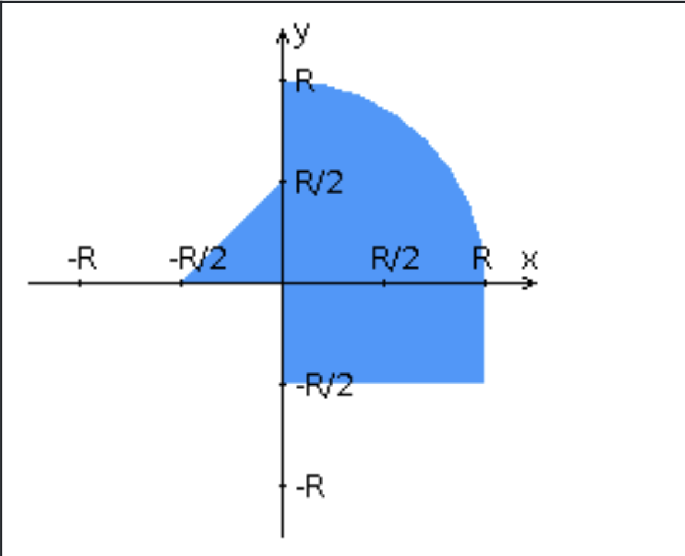

# 🚀 Java FastCGI Hit-Test Lab


A minimal **FastCGI** server in **Java** using your `com.fastcgi.*` library + a static **Nginx** front end.
The UI posts `(x, y, r)` via **AJAX** to `/api/check`; the Java app validates, computes hit/miss against a composite area, and returns JSON. Previous results are kept in memory and rendered in a table.

---

## 🧭 Table of Contents

* [Overview](#-overview)
* [Demo](#-demo)
* [Features](#-features)
* [Hit Area (Geometry)](#-hit-area-geometry)
* [Project Structure](#-project-structure)
* [Quick Start (Docker)](#-quick-start-docker)
* [API](#-api)
* [Client Validation](#-client-validation)
* [How it Flows](#-how-it-flows)
* [Troubleshooting](#-troubleshooting)

---

## ✨ Overview

* **Pure FastCGI** (no HTTP fallback) via `com.fastcgi.FCGIInterface`
* **AJAX** POST with no page reload
* **Client + Server validation**
* **Inclusive borders** for all shapes
* **In-memory history** shown in a table
* **Dockerized** deployment

---

## 🎥 Demo

> Open `http://localhost:8088`.
> The UI uses a table layout (HTML/CSS) and vanilla JS for AJAX & validation.



---

## 🧩 Features

* 🔌 **FastCGI**: Java reads `REQUEST_METHOD`, `CONTENT_TYPE`, `CONTENT_LENGTH` from `System.getProperties()` (as provided by the FastCGI lib) and consumes exactly `CONTENT_LENGTH` bytes from `stdin`.
* 🧮 **Hit test**: Union of three shapes (rectangle, triangle, quarter-circle).
* 🗂️ **History**: Latest results first; kept in process memory.
* 🧪 **CURL smoke test** included.
* 🐳 **Docker/Compose**: One command to run.

---

## 📐 Hit Area (Geometry)

A point is **inside** if it satisfies **any** of the shapes below (borders included):

|          Shape | Quadrant | Condition                                                           |
| -------------: | :------: | :------------------------------------------------------------------ |
|      Rectangle |    IV    | `x ≥ 0` AND `y ≤ 0` AND `x ≤ r` AND `y ≥ −r/2`                      |
|       Triangle |    II    | `x ≤ 0` AND `y ≥ 0` AND `x ≥ −r/2` AND `y ≤ r/2` AND `y ≥ −x − r/2` |
| Quarter-circle |     I    | `x ≥ 0` AND `y ≥ 0` AND `x ≤ r` AND `y ≤ r` AND `x² + y² ≤ r²`      |

Examples:

* `(1, 1, r=1)` → **miss** (distance √2 > 1)
* `(1, 1, r=2)` → **hit** (inside quarter-circle)

---

## 🗂 Project Structure

```
.
├─ lib/
│  └─ fastcgi-lib.jar                # your FastCGI library (com.fastcgi.*)
├─ server-java/
│  ├─ Dockerfile
│  └─ java-src/app/Server.java       # FastCGI app
├─ web/
│  ├─ Dockerfile
│  ├─ nginx/nginx.conf               # static + fastcgi_pass
│  └─ static/
│     ├─ index.html
│     ├─ css/index.css
│     ├─ js/app.js                   # AJAX + client validation
│     └─ media/graph.png
└─ docker-compose.yml
```

---

## ⚡ Quick Start (Docker)

```bash
docker compose down -v
docker compose up --build
# open http://localhost:8088
```

**Nginx → FastCGI** (excerpt from `web/nginx/nginx.conf`):

```nginx
location /api/check {
  include fastcgi_params;
  fastcgi_param SCRIPT_FILENAME /api/check;
  fastcgi_param SCRIPT_NAME     /api/check;

  # ensure POST body metadata are forwarded
  fastcgi_param CONTENT_LENGTH  $content_length;
  fastcgi_param CONTENT_TYPE    $content_type;

  fastcgi_pass fastcgi-java:9000;
}
```

**Java entry (server-java/Dockerfile)** starts with:

```dockerfile
CMD ["java","-cp","/app/out:/app/lib/fastcgi-lib.jar","-DFCGI_PORT=9000","app.Server"]
```

---

## 🔌 API

### `POST /api/check`

**Request (JSON):**

```json
{ "x": 1.0, "y": 1, "r": 2.0 }
```

**Validation**

* `x`: number in **\[-3, 3]**
* `y`: integer in **{-3, -2, -1, 0, 1, 2, 3, 4, 5}**
* `r`: number in **\[1, 4]**

**Response (JSON):**

```json
{
  "ok": true,
  "item": {
    "time": "2025-09-17 01:23:45",
    "x": 1.0,
    "y": 1.0,
    "r": 2.0,
    "hit": true,
    "durationMs": 0,
    "debugRect": false,
    "debugTri": false,
    "debugCirc": true
  },
  "history": [ /* latest first */ ]
}
```

**cURL smoke test**

```bash
curl -i -X POST http://localhost:8088/api/check \
  -H 'Content-Type: application/json' \
  --data '{"x":1,"y":1,"r":2}'
```

---

## ✅ Client Validation

* `X` must be numeric, `-3 ≤ x ≤ 3`
* `Y` is chosen from radio buttons `{-3 … 5}`
* `R` must be numeric, `1 ≤ r ≤ 4`
* Invalid input blocks the request and shows a message

---

## 🔄 How it Flows


---

## 🧰 Troubleshooting

* **502 Bad Gateway**
  Java probably isn’t listening on FastCGI. Confirm Java starts with `-DFCGI_PORT=9000` and Nginx has `fastcgi_pass fastcgi-java:9000`.

* **`{"ok":false,"error":"Method Not Allowed (use POST)"}`**
  The app reads CGI vars from `System.getProperties()` (per the FastCGI lib). Ensure `include fastcgi_params` and that Nginx forwards `CONTENT_LENGTH`/`CONTENT_TYPE` as above.

* **Empty body / Bad request**
  Request must have `Content-Type: application/json` and a valid `Content-Length`. Nginx should forward both via `fastcgi_param`.

* **Verify what the app receives**
  Container logs print lines like
  `FCGI REQ: method=POST len=NN body={"x":...,"y":...,"r":...}`.


